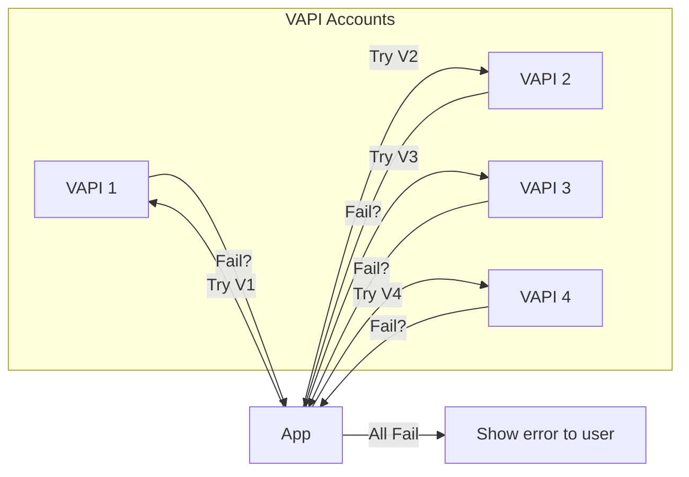
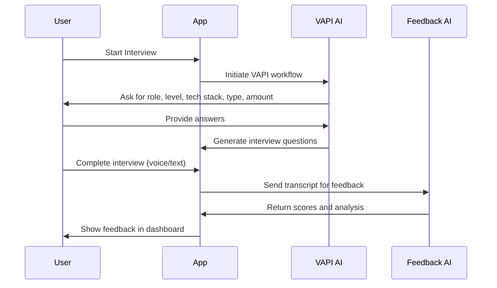

# IntelliPrep: AI Mock Interview Platform

## Project Overview

IntelliPrep is a full-stack, AI-powered mock interview platform. It enables users to:

- Practice job interviews with an AI interviewer.
- Receive instant, structured feedback.
- Explore and take interviews created by other users.
- Manage their interview history and feedback in a responsive dashboard.

Built with **Next.js**, **TypeScript**, **Firebase**, **Tailwind CSS**, and **VAPI AI API**.

---

## Architecture Diagram

```mermaid
graph TD
    A[User (Web/Mobile)] -->|Sign In/Up| B[Next.js App]
    B -->|Auth| C[Firebase Auth]
    B -->|Interview Data| D[Firestore DB]
    B -->|AI Interview| E[VAPI API (Multi-Account)]
    B -->|Feedback| F[AI Feedback (Gemini/Google)]
    B -->|Deployment| G[Vercel]
```

---

## Development Phases (with Technical Depth)

### 1. Authentication & User Management

- **Firebase Auth** for secure sign-up/sign-in.
- Custom error handling: user-friendly messages for invalid credentials, disabled accounts, etc.
- Session management using Firebase session cookies.

### 2. Interview Generation & Feedback

- **VAPI AI API** integration for real-time, voice-based interview simulation.
- Dynamic workflow: AI asks for role, level, tech stack, type, and number of questions, then generates a tailored interview.
- **Feedback Generation**: After the interview, AI (Gemini/Google) analyzes the transcript and scores the user in multiple categories.

### 3. Multi-Account VAPI Integration

- **Why?** VAPI accounts have credit limits; multi-account support ensures reliability.
- **How?**
  - Accounts are rotated based on error count and last usage.
  - If an account fails (e.g., out of credits), the system automatically switches to the next available account.
  - Admin utility to check/reset account status.



### 4. Dashboard & Interview Management

- **Three main sections:**
  1. **Get Interview-Ready:** CTA to start a new interview.
  2. **Your Interviews:** List of user’s own interviews, with feedback and scores.
  3. **Take Interviews:** List of interviews created by other users (not yet taken by the current user).
- **InterviewCard Component:** Responsive, shows role, type, tech stack, date, and feedback.

### 5. Responsive Design

- **Tailwind CSS** utility classes for mobile-first design.
- All layouts, cards, and buttons adapt to screen size.
- Verified on both desktop and mobile.

### 6. Code Quality & Production Readiness

- Removed all `console.log` and debug code.
- Fixed all critical lint errors and warnings.
- Ensured clean builds and lints.
- Modular, maintainable code structure.

### 7. Deployment

- **GitHub** for version control.
- **Vercel** for CI/CD and hosting.
- Automatic deployment on push to main branch.

---

## Key Features (Technical Details)

- **AI Interviewer:** Uses VAPI’s voice API for real-time, interactive interviews.
- **Feedback Engine:** Uses Gemini/Google AI for transcript analysis and scoring.
- **Multi-Account API Handling:** Rotates through VAPI accounts, disables on repeated errors.
- **User Dashboard:** React/Next.js components, server-side data fetching, and client-side interactivity.
- **Mobile-First:** Uses Tailwind’s responsive classes, flex layouts, and adaptive images.

---

## Lessons Learned & Best Practices

- **User Experience:** Clear, actionable error messages and feedback loops are essential.
- **Reliability:** Multi-account API handling prevents downtime and ensures smooth user experience.
- **Code Quality:** Regular linting, removal of debug code, and responsive design checks are crucial.
- **Continuous Deployment:** GitHub + Vercel enables rapid iteration and easy rollbacks.

---

## Deployment & Usage Instructions

1. **Clone the repo:**

   ```bash
   git clone https://github.com/yourusername/IntelliPrep_01.git
   cd IntelliPrep_01
   ```

2. **Install dependencies:**

   ```bash
   npm install
   ```

3. **Set up environment variables:**

   - Copy `.env-template` to `.env.local` and fill in your Firebase and VAPI credentials.

4. **Run locally:**

   ```bash
   npm run dev
   ```

5. **Build and deploy:**
   - Push to GitHub.
   - Connect to Vercel for automatic deployment.

---

## Workflow Diagram: Interview Generation



---

## Screenshots & UI (Add your own screenshots here)

- Dashboard on desktop and mobile
- Interview in progress
- Feedback view

---

## Final Thoughts

IntelliPrep is a robust, scalable, and user-friendly platform for AI-powered interview practice. It demonstrates best practices in authentication, API integration, responsive design, and CI/CD deployment.

---
